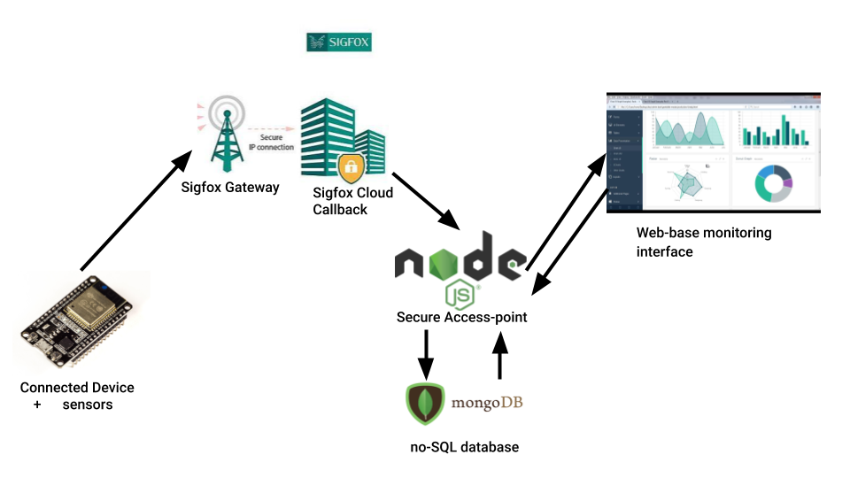

# Projet Cours IOT M1 "Sams'ISEN"

* Joseph de Gourcuff
* Florent Deroo
* Corentin Duval

## Idées principales de notre solution 
Pour ce projet nous sommes parti dans l'idée de créer un systeme d'acquisition de données et de monitoring le plus générique possible. Pour avoir un réseau accesible le plus largement en France (Ville, Campagne, capteurs en déplacement) nous avons optés pour le réseau sigfox, en sachant que nous serons donc limité au niveau de la quantité de data envoyable par jour.
Pour le capteur nous avons aussi opté pour une solution générique, l'ESP32 qui permet une grande flexibilité dans le choix des capteurs utilisés, en effet ce microcontroleurs est pourvu à la fois d'entrées numérique, d'un ADC et de plusieurs interfaces tels que la liaison série (UART), le 1-wire, l'i2c et le SPI entre autre. Pour notre capteur de démonstration, captons l'humidité relative et la température grâce à un DTH11 et la luminosité grâce à une photorésistance.

## Structure

Le schéma ci-dessus montre le fonctionnement global du système.
Le capteur qui reste en veille la plupart du temps va sortir du sommeil pour prendre les données, les envoyés sur le réseaux sigfox qui va ensuite les envoyés sur notre API en Node JS. Cette API va servir à receptionner les données du réseaux sigfox, vérifiés la conformité des données, les stockers sur une base de données MongoDB puis les mettre à disposotion des différentes interfaces Web de monitoring. 
## ESP32

## CallBack SigFox


```console
"temperature":"{customData#temperature}",
"humidity":"{customData#humidity}",
"battery":"{customData#battery}" ,
```

## Back-end 

#### Technologies utilisés : 

* **Node JS**
* **Express JS** création du serveur http et traitement des routes + layer sécurité.
* **Mongo DB** stockage des données. 
* **Express JSON parser** middleware Express pour le parsing des requests

#### Prérequis et Instalation : 

Pour faire fonctionner notre back-end il faut **Mongo DB** au moins à la version *3.6.3* (https://docs.mongodb.com/manual/installation/) ainsi que **NodeJS** au moins à la version *11.15.0* (https://nodejs.org/en/).

Pour tester les versions installés : 
Pour Node
```console
 $ node --version
 
  v11.15.0
```
Pour Mongo DB
```console
$ mongo --version

  MongoDB shell version v3.6.3
  git version: 9586e557d54ef70f9ca4b43c26892cd55257e1a5
  OpenSSL version: OpenSSL 1.1.1  11 Sep 2018
  allocator: tcmalloc
  modules: none
  build environment:
      distarch: x86_64
      target_arch: x86_64
```

On peut cloner le repository : 
```console
$ git clone https://github.com/Duval-Corentin/weather_station_projet_iot_m1.git
$ cd weather_station_projet_iot_m1/back_end
```
On lance le serveur mongo : 
```console
$ mongod --dbpath db/ --port 3001

[...]
2020-02-26T19:43:02.734+0100 I FTDC     [initandlisten] Initializing full-time diagnostic data capture with directory 'back-end/db/diagnostic.data'
2020-02-26T19:43:02.735+0100 I NETWORK  [initandlisten] waiting for connections on port 3001
```

On peut ensuite lancer le script du back-end : 
```console
$ node index.js

Sams'ISEN back-end listening on port 3000.
```
## Front-end
L'interface est continué d'une page Web accesible à partir du fichier *index.html* situé dans le dossier *front-end*. 
Pour réaliser cette interface nous avons utilisé les framworks suivants : 

* **Semantic UI** (https://semantic-ui.com/) pour l'UI
* **Handlebars.js** (https://handlebarsjs.com/) pour la gestion des templates HTML
* **Jquery** (https://jquery.com/) comme librairie JS
* **Charts.js** (https://www.chartjs.org/) pour la gestion des graphs

L'inteface permet de voir tous les capteurs associés à un utilisateur, et d'afficher les données des différentes variables captés par les différents capteurs sur plusieurs échelles de temps. 

# Amélioration evisagables

* mise en place d'un layer "sécurité" au niveau du back-end (HTTPS & authentification de bout en bout)
* amélioration de l'interface graphque avec plus d'options d'affichage de graph
* possiblité de rajouter des capteurs au système "à la volée", avec pourquoi pas une page "administration" au niveau de l'interface graphique
* possibilité de comparer les données de plusieurs capteurs / plusieurs périodes temporelles. 
* géolocalisation des capteurs (Sigfox, GPRS, saisie utilisateur)
